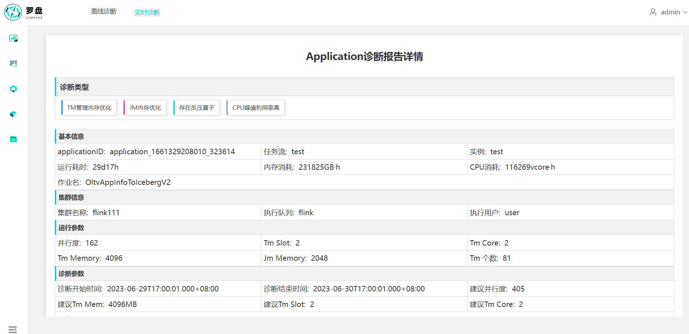

# 罗盘

[English document](README.md)

罗盘是一个大数据任务诊断平台，旨在提升用户排查问题效率，降低用户异常任务成本。

其主要功能特性如下：

- 非侵入式，即时诊断，无需修改已有的调度平台，即可体验诊断效果。
- 支持多种主流调度平台，例如DolphinScheduler 2.x和3.x、Airflow或自研等。
- 支持多版本Spark、MapReduce、Flink、Hadoop 2.x和3.x 任务日志诊断和解析。
- 支持工作流层异常诊断，识别各种失败和基线耗时异常问题。
- 支持引擎层异常诊断，包含数据倾斜、大表扫描、内存浪费等14种异常类型。
- 支持各种日志匹配规则编写和异常阈值调整，可自行根据实际场景优化。
- 支持一键诊断全量(包含非调度平台提交任务)Spark/MapReduce任务

## 文档

[部署指南](document/manual/deployment_zh.md)

[架构文档](document/manual/architecture_zh.md)

## 社区

欢迎加入社区咨询使用或成为 Compass 开发者。以下是获得帮助的方法：

- 提交 [issue](https://github.com/cubefs/compass/issues).
- 提交 pull request, 请阅读 [contributing guideline](https://github.com/cubefs/compass/blob/main/CONTRIBUTING.md),
- 讨论 [Idea & Question](https://github.com/cubefs/compass/discussions).

我们将会尽快回复。

罗盘已支持诊断类型概览：

<table>
    <tr>
        <td>引擎</td>
        <td>诊断维度</td>
        <td>诊断类型</td>
        <td>类型说明</td>
    </tr>
    <tr>
        <td rowspan="20">Spark</td>
        <td rowspan="3">失败分析</td>
        <td>运行失败</td>
        <td>最终运行失败的任务</td>
    </tr>
    <tr>
        <td>首次失败</td>
        <td>重试次数大于1的成功任务</td>
    </tr>
    <tr>
        <td>长期失败</td>
        <td>最近10天运行失败的任务</td>
    </tr>
    <tr>
        <td rowspan="3">耗时分析</td>
        <td>基线时间异常</td>
        <td>相对于历史正常结束时间，提前结束或晚点结束的任务</td>
    </tr>
    <tr>
        <td>基线耗时异常</td>
        <td>相对于历史正常运行时长，运行时间过长或过短的任务</td>
    </tr>
    <tr>
        <td>运行耗时长</td>
        <td>运行时间超过2小时的任务</td>
    </tr>
    <tr>
        <td rowspan="3">报错分析</td>
        <td>sql失败</td>
        <td>因sql执行问题而导致失败的任务</td>
    </tr>
    <tr>
        <td>shuffle失败</td>
        <td>因shuffle执行问题而导致失败的任务</td>
    </tr>
    <tr>
        <td>内存溢出</td>
        <td>因内存溢出问题而导致失败的任务</td>
    </tr>
    <tr>
        <td rowspan="2">资源分析</td>
        <td>内存浪费</td>
        <td>内存使用峰值与总内存占比过低的任务</td>
    </tr>
    <tr>
        <td>CPU浪费</td>
        <td>driver/executor计算时间与总CPU计算时间占比过低的任务</td>
    </tr>
    <tr>
        <td rowspan="9">效率分析</td>
        <td>大表扫描</td>
        <td>没有限制分区导致扫描行数过多的任务</td>
    </tr>
    <tr>
        <td>OOM预警</td>
        <td>广播表的累计内存与driver或executor任意一个内存占比过高的任务</td>
    </tr>
    <tr>
        <td>数据倾斜</td>
        <td>stage中存在task处理的最大数据量远大于中位数的任务</td>
    </tr>
    <tr>
        <td>Job耗时异常</td>
        <td>job空闲时间与job运行时间占比过高的任务</td>
    </tr>
    <tr>
        <td>Stage耗时异常</td>
        <td>stage空闲时间与stage运行时间占比过高的任务</td>
    </tr>
    <tr>
        <td>Task长尾</td>
        <td>stage中存在task最大运行耗时远大于中位数的任务</td>
    </tr>
    <tr>
        <td>HDFS卡顿</td>
        <td>stage中存在task处理速率过慢的任务</td>
    </tr>
    <tr>
        <td>推测执行Task过多</td>
        <td>stage中频繁出现task推测执行的任务</td>
    </tr>
    <tr>
        <td>全局排序异常</td>
        <td>全局排序导致运行耗时过长的任务</td>
    </tr>
    <tr>
        <td rowspan="6">MapReduce</td>
        <td rowspan="1">资源分析</td>
        <td>内存浪费</td>
        <td>内存使用峰值与总内存占比过低的任务</td>
    </tr>
    <tr>
        <td rowspan="5">效率分析</td>
        <td>大表扫描</td>
        <td>扫描行数过多的任务</td>
    </tr>
    <tr>
        <td>Task长尾</td>
        <td>map/reduce task最大运行耗时远大于中位数的任务</td>
    </tr>
    <tr>
        <td>数据倾斜</td>
        <td>map/reduce task处理的最大数据量远大于中位数的任务</td>
    </tr>
    <tr>
        <td>推测执行Task过多</td>
        <td>map/reduce task中频繁出现推测执行的任务</td>
    </tr>
    <tr>
        <td>GC异常</td>
        <td>GC时间相对CPU时间占比过高的任务</td>
    </tr>
    <tr>
        <td rowspan="20">Flink</td>
        <td rowspan="10">资源诊断</td>
        <td>内存利用率高</td>
        <td>计算内存的使用率，如果使用率高于阈值，则增加内存</td>
    </tr>
    <tr>
        <td>内存利用率低</td>
        <td>计算内存的使用率，如果使用率低于阈值，则降低内存</td>
    </tr>
    <tr>
        <td>JM内存优化</td>
        <td>根据tm个数计算jm内存的建议值</td>
    </tr>
    <tr>
        <td>作业无流量</td>
        <td>检测作业的kafka source算子是否没有流量</td>
    </tr>
    <tr>
        <td>TM管理内存优化</td>
        <td>计算作业管理内存的使用率，给出合适的管理内存建议值</td>
    </tr>
    <tr>
        <td>部分TM空跑</td>
        <td>检测是否有tm没有流量，并且cpu和内存也没有使用</td>
    </tr>
    <tr>
        <td>并行度不够</td>
        <td>检测作业是否因为并行度不够引起延迟</td>
    </tr>
    <tr>
        <td>CPU利用率高</td>
        <td>计算作业的CPU均值使用率，如果高于阈值，则增加cpu</td>
    </tr>
    <tr>
        <td>CPU利用率低</td>
        <td>计算作业的CPU均值使用率，如果低于阈值，则降低cpu</td>
    </tr>
    <tr>
        <td>CPU峰值利用率高</td>
        <td>计算作业的CPU峰值使用率，如果高于阈值，则增加cpu</td>
    </tr>
    <tr>
        <td rowspan="3">异常诊断</td>
        <td>存在慢算子</td>
        <td>检测作业是否存在慢算子</td>
    </tr>
    <tr>
        <td>存在反压算子</td>
        <td>检测作业是否存在反压算子</td>
    </tr>
    <tr>
        <td>作业延迟高</td>
        <td>检测作业的kafka延迟是否高于阈值</td>
    </tr>
</table>

## UI

Spark:

Flink:

=======

## 版权

罗盘许可证是 [Apache License, Version 2.0](http://www.apache.org/licenses/LICENSE-2.0)，详情请参考 [LICENSE](LICENSE)
and [NOTICE](NOTICE) 。

## 引用
Drain算法基于`Logpai`项目, 详情请查看
- [https://github.com/logpai/Drain3](https://github.com/logpai/Drain3)
- [https://jiemingzhu.github.io/pub/pjhe_icws2017.pdf](https://jiemingzhu.github.io/pub/pjhe_icws2017.pdf)
