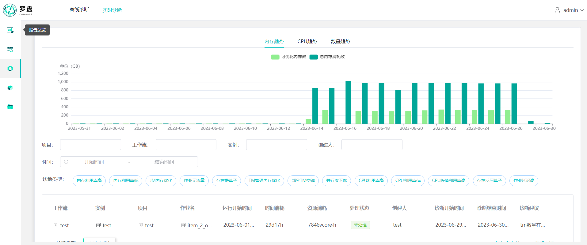

# 罗盘

[English document](README.md)

罗盘是一个大数据任务诊断平台，旨在提升用户排查问题效率，降低用户异常任务成本。

其主要功能特性如下：

- 非侵入式，即时诊断，无需修改已有的调度平台，即可体验诊断效果。
- 支持多种主流调度平台，例如DolphinScheduler 2.x和3.x、Airflow或自研等。
- 支持多版本Spark、MapReduce、Flink、Hadoop 2.x和3.x 任务日志诊断和解析。
- 支持工作流层异常诊断，识别各种失败和基线耗时异常问题。
- 支持引擎层异常诊断，包含数据倾斜、大表扫描、内存浪费等14种异常类型。
- 支持各种日志匹配规则编写和异常阈值调整，可自行根据实际场景优化。

罗盘已支持诊断类型概览：

<table>
    <tr>
        <td>引擎</td>
        <td>诊断维度</td>
        <td>诊断类型</td>
        <td>类型说明</td>
    </tr>
    <tr>
        <td rowspan="20">Spark</td>
        <td rowspan="3">失败分析</td>
        <td>运行失败</td>
        <td>最终运行失败的任务</td>
    </tr>
    <tr>
        <td>首次失败</td>
        <td>重试次数大于1的成功任务</td>
    </tr>
    <tr>
        <td>长期失败</td>
        <td>最近10天运行失败的任务</td>
    </tr>
    <tr>
        <td rowspan="3">耗时分析</td>
        <td>基线时间异常</td>
        <td>相对于历史正常结束时间，提前结束或晚点结束的任务</td>
    </tr>
    <tr>
        <td>基线耗时异常</td>
        <td>相对于历史正常运行时长，运行时间过长或过短的任务</td>
    </tr>
    <tr>
        <td>运行耗时长</td>
        <td>运行时间超过2小时的任务</td>
    </tr>
    <tr>
        <td rowspan="3">报错分析</td>
        <td>sql失败</td>
        <td>因sql执行问题而导致失败的任务</td>
    </tr>
    <tr>
        <td>shuffle失败</td>
        <td>因shuffle执行问题而导致失败的任务</td>
    </tr>
    <tr>
        <td>内存溢出</td>
        <td>因内存溢出问题而导致失败的任务</td>
    </tr>
    <tr>
        <td rowspan="2">资源分析</td>
        <td>内存浪费</td>
        <td>内存使用峰值与总内存占比过低的任务</td>
    </tr>
    <tr>
        <td>CPU浪费</td>
        <td>driver/executor计算时间与总CPU计算时间占比过低的任务</td>
    </tr>
    <tr>
        <td rowspan="9">效率分析</td>
        <td>大表扫描</td>
        <td>没有限制分区导致扫描行数过多的任务</td>
    </tr>
    <tr>
        <td>OOM预警</td>
        <td>广播表的累计内存与driver或executor任意一个内存占比过高的任务</td>
    </tr>
    <tr>
        <td>数据倾斜</td>
        <td>stage中存在task处理的最大数据量远大于中位数的任务</td>
    </tr>
    <tr>
        <td>Job耗时异常</td>
        <td>job空闲时间与job运行时间占比过高的任务</td>
    </tr>
    <tr>
        <td>Stage耗时异常</td>
        <td>stage空闲时间与stage运行时间占比过高的任务</td>
    </tr>
    <tr>
        <td>Task长尾</td>
        <td>stage中存在task最大运行耗时远大于中位数的任务</td>
    </tr>
    <tr>
        <td>HDFS卡顿</td>
        <td>stage中存在task处理速率过慢的任务</td>
    </tr>
    <tr>
        <td>推测执行Task过多</td>
        <td>stage中频繁出现task推测执行的任务</td>
    </tr>
    <tr>
        <td>全局排序异常</td>
        <td>全局排序导致运行耗时过长的任务</td>
    </tr>
    <tr>
        <td rowspan="6">MapReduce</td>
        <td rowspan="1">资源分析</td>
        <td>内存浪费</td>
        <td>内存使用峰值与总内存占比过低的任务</td>
    </tr>
    <tr>
        <td rowspan="5">效率分析</td>
        <td>大表扫描</td>
        <td>扫描行数过多的任务</td>
    </tr>
    <tr>
        <td>Task长尾</td>
        <td>map/reduce task最大运行耗时远大于中位数的任务</td>
    </tr>
    <tr>
        <td>数据倾斜</td>
        <td>map/reduce task处理的最大数据量远大于中位数的任务</td>
    </tr>
    <tr>
        <td>推测执行Task过多</td>
        <td>map/reduce task中频繁出现推测执行的任务</td>
    </tr>
    <tr>
        <td>GC异常</td>
        <td>GC时间相对CPU时间占比过高的任务</td>
    </tr>
    <tr>
        <td rowspan="20">Flink</td>
        <td rowspan="10">资源诊断</td>
        <td>内存利用率高</td>
        <td>计算内存的使用率，如果使用率高于阈值，则增加内存</td>
    </tr>
    <tr>
        <td>内存利用率低</td>
        <td>计算内存的使用率，如果使用率低于阈值，则降低内存</td>
    </tr>
    <tr>
        <td>JM内存优化</td>
        <td>根据tm个数计算jm内存的建议值</td>
    </tr>
    <tr>
        <td>作业无流量</td>
        <td>检测作业的kafka source算子是否没有流量</td>
    </tr>
    <tr>
        <td>TM管理内存优化</td>
        <td>计算作业管理内存的使用率，给出合适的管理内存建议值</td>
    </tr>
    <tr>
        <td>部分TM空跑</td>
        <td>检测是否有tm没有流量，并且cpu和内存也没有使用</td>
    </tr>
    <tr>
        <td>并行度不够</td>
        <td>检测作业是否因为并行度不够引起延迟</td>
    </tr>
    <tr>
        <td>CPU利用率高</td>
        <td>计算作业的CPU均值使用率，如果高于阈值，则增加cpu</td>
    </tr>
    <tr>
        <td>CPU利用率低</td>
        <td>计算作业的CPU均值使用率，如果低于阈值，则降低cpu</td>
    </tr>
    <tr>
        <td>CPU峰值利用率高</td>
        <td>计算作业的CPU峰值使用率，如果高于阈值，则增加cpu</td>
    </tr>
    <tr>
        <td rowspan="3">异常诊断</td>
        <td>存在慢算子</td>
        <td>检测作业是否存在慢算子</td>
    </tr>
    <tr>
        <td>存在反压算子</td>
        <td>检测作业是否存在反压算子</td>
    </tr>
    <tr>
        <td>作业延迟高</td>
        <td>检测作业的kafka延迟是否高于阈值</td>
    </tr>
</table>

## 如何使用

### 1. 代码编译

使用 JDK 8 and maven 3.6.0+ 编译

```shell
git clone https://github.com/cubefs/compass.git
cd compass
mvn package -DskipTests
```

### 2. 配置修改

```shell
cd dist/compass

vi bin/compass_env.sh
# Scheduler MySQL
export SCHEDULER_MYSQL_ADDRESS="ip:port"
export SCHEDULER_MYSQL_DB="scheduler"
export SCHEDULER_DATASOURCE_USERNAME="user"
export SCHEDULER_DATASOURCE_PASSWORD="pwd"
# Compass MySQL
export COMPASS_MYSQL_ADDRESS="ip:port"
export COMPASS_MYSQL_DB="compass"
export SPRING_DATASOURCE_USERNAME="user"
export SPRING_DATASOURCE_PASSWORD="pwd"
# Kafka (默认版本: 3.4.0)
export SPRING_KAFKA_BOOTSTRAPSERVERS="ip1:port,ip2:port"
# Redis (cluster 模式)
export SPRING_REDIS_CLUSTER_NODES="ip1:port,ip2:port"
# Zookeeper (默认版本: 3.4.5, canal使用)
export SPRING_ZOOKEEPER_NODES="ip1:port,ip2:port"
# Elasticsearch (默认版本: 7.17.9)
export SPRING_ELASTICSEARCH_NODES="ip1:port,ip2:port"
# Flink metric prometheus
export FLINK_PROMETHEUS_HOST="host"
export FLINK_PROMETHEUS_TOKEN=""
export FLINK_PROMETHEUS_DATABASE=""
```

```shell
vi conf/application-hadoop.yml
hadoop:
  namenodes:
    - nameservices: logs-hdfs # the value of dfs.nameservices
      namenodesAddr: [ "machine1.example.com", "machine2.example.com" ] # the value of dfs.namenode.rpc-address.[nameservice ID].[name node ID]
      namenodes: [ "nn1", "nn2" ] # the value of dfs.ha.namenodes.[nameservice ID]
      user: hdfs
      password:
      port: 8020
      # scheduler platform hdfs log path keyword identification, used by task-application
      matchPathKeys: [ "flume" ]
      # kerberos
      enableKerberos: false
      # /etc/krb5.conf
      krb5Conf: ""
      # hdfs/*@EXAMPLE.COM
      principalPattern:  ""
      # admin
      loginUser: ""
      # /var/kerberos/krb5kdc/admin.keytab
      keytabPath: ""      

  yarn:
    - clusterName: "bigdata"
      resourceManager: [ "machine1:8088", "machine2:8088" ] # the value of yarn.resourcemanager.webapp.address
      jobHistoryServer: "machine3:19888" # the value of mapreduce.jobhistory.webapp.address

  spark:
    sparkHistoryServer: [ "machine4:18080" ] # the value of spark.history.ui

```

### 3. 初始化数据库和表

Compass 表结构由两部分组成，一个是compass.sql，另一个是依赖调度平台的表（dolphinscheduler.sql 或者 airflow.sql等）

1. 请先执行document/sql/compass.sql

2. 如果您使用的是DolphinScheduler调度平台，请执行document/sql/dolphinscheduler.sql（需要根据实际使用版本修改）； 如果您使用的是Airflow调度平台，请执行document/sql/airflow.sql（需要根据实际使用版本修改）

3. 如果您使用的是自研调度平台，请参考[task-syncer](#task-syncer)模块，确定需要同步的表

### 4. 一键部署

```
./bin/start_all.sh
```

### 5. 自定义上报元数据

第三方系统可以通过kafka消息队列或者http接口的方式自定义上报Flink作业元数据到Compass系统, 用户无需运行canal相关组件抓取调度器元数据， 上报格式如下:

上报内容:

```json
{
  // 必填内容
  "startTime": "2023-06-01",
  // 作业开始时间
  "projectName": "test",
  // 项目名称
  "flowName": "test",
  // 数据流名称
  "taskName": "test",
  // 任务名称
  "jobName": "job_name",
  // 作业名称
  "username": "test",
  // 用户名
  "flinkTrackUrl": "tracking url",
  // 作业 trackingutl
  "taskState": "RUNNING",
  // 运行状态
  "parallel": 150,
  // 作业并行度
  "tmSlot": 1,
  // tm slot
  "tmCore": 2,
  // tm core
  "jmMem": 1024,
  // jm 内存MB
  "tmMem": 4096,
  // tm 内存MB

  // 非必填内容
  "userId": 1,
  // 用户id
  "projectId": 1,
  // 项目id
  "flowId": 1,
  // 数据流id
  "taskId": 1,
  // 任务id
  "taskInstanceId": 1,
  // 任务实例id
  "executionTime": "2023-06-01",
  // 执行时间
  "allocatedMb": 1,
  // yarn分配的内存资源
  "allocatedVcores": 1,
  // yarn分配的core
  "runningContainers": 1,
  // 运行容器数量
  "engineType": "flink",
  // 引擎类别
  "duration": "1",
  // 作业持续时间
  "endTime": "2023-06-01",
  // 作业结束时间
  "vcoreSeconds": 1,
  // vcore时间
  "memorySeconds": 1,
  // 内存时间
  "queue": "flink",
  // 队列 flink
  "clusterName": "flink",
  // 集群名称 
  "retryTimes": 1,
  // 重试次数
  "executeUser": "user",
  // 执行用户
  "createTime": "2023-06-01",
  // 创建时间
  "updateTime": "2023-06-01",
  // 更新时间
  "diagnosis": "1",
  // yarn诊断
  "applicationId": "app id"
  // app id
}
```

Kafka上报方式:  
发送上述元数据内容到flink-task-app主题。若想修改主题名称，可以修改task-flink模块，application.yml文件中的spring.kafka.flinkTaskApp属性。

Http接口上报方式:  
发送post请求到http://[compass_host]/compass/api/flink/saveRealtimeTaskApp, http请求body填入上述元数据内容。

## 文档

[架构文档](document/manual/architecture.md)

[部署指南](document/manual/deployment.md)

## 系统截图

Spark:


Flink:




=======

## 社区

欢迎加入社区咨询使用或成为 Compass 开发者。以下是获得帮助的方法：

- 提交 [issue](https://github.com/cubefs/compass/issues). 我们将会尽快做出回应。
- 如果觉得我们产品不错，可以点赞star支持我们，你们的支持，将是我们打造更好产品的动力。

## 版权

罗盘许可证是 [Apache License, Version 2.0](http://www.apache.org/licenses/LICENSE-2.0)，详情请参考 [LICENSE](LICENSE)
and [NOTICE](NOTICE) 。

